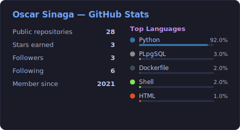

<h1 align="center">Hi, I'm Oscar Sinaga 👋</h1>

  <b>Data Engineer · Data Scientist · Credit Risk Modeler</b> 
  I build the data pipelines <i>and</i> the models that run on top of them — from raw data to production ML in the financial services sector.

  
  

---

### 👤 About Me

I'm a **Data Engineer** who grew into **data science** and **credit risk modeling**. My foundation is engineering: designing ETL/ELT pipelines, orchestrating workflows, and processing data at scale. On top of that I develop the models the business actually uses — with a strong focus on **credit scoring**, where a model's *transparency and auditability* matter as much as its accuracy.

What I enjoy most is owning the full path end to end: getting the data flowing reliably, building and validating the model, and doing the MLOps work to keep it running in production — not just living in a notebook.

---

### 🧰 Tech Stack

**Data Engineering**

  
  
  
  
  

**Languages & Analysis**

  
  
  
  

**Machine Learning & MLOps**

  
  
  
  
  
  
  

| Domain | What I work with |
| :--- | :--- |
| **Data Engineering** | ETL/ELT design, workflow orchestration (Airflow), distributed processing (PySpark), data warehousing, data modeling |
| **Credit Risk / Scoring** | Credit scorecard development, creditworthiness prediction, model validation & documentation |
| **Data Science / ML** | Classification & regression, feature engineering, EDA, model evaluation |
| **NLP** | Aspect-based sentiment analysis, named-entity recognition, text classification |
| **MLOps** | TFX pipelines, MLflow experiment tracking, CI/CD for model training & deployment |

---

### 🚀 What I'm Working On

- 🔧 Designing and orchestrating **data pipelines** — moving from raw sources to analysis- and model-ready data with Airflow and PySpark.
- 🏦 Building an **automated credit scorecard engine** — WoE/IV auto-binning, feature selection over logistic regression, and audit-ready reporting, so risk models are faster to build and consistent to validate.
- ⚙️ Deepening **MLOps** practice: reproducible pipelines with **TFX**, experiment tracking with **MLflow**, and **CI/CD** so training and deployment run automatically.

---

### 💼 Selected Professional & Private Work

Some of my recent work lives in private/internal repositories. A few highlights:

- **AutoScorecard Engine** — an automated, **audit-ready credit-risk scorecard engine** I designed and built end to end:
  - **WoE/IV AutoBinning** across 140+ features — strictly-monotonic coarse binning, adaptive population floor, Haldane–Anscombe smoothing, special-code isolation, and Excel reporting kept in Python↔spreadsheet formula parity for audit.
  - An original **IV Stabilization Score** (0–100 reliability diagnostic) that de-prioritizes fragile features during selection without ever altering the WoE/scoring.
  - **SmartCreditScorer** — BFS forward feature-selection over logistic regression with statistical constraints (coefficient sign, significance, correlation), multi-core fitting, checkpoint/resume, a SQLite audit trail, and a reproducible model card.
  - A batched-IRLS scale engine to push toward thousands of features, now growing into a full web app.
  - `Python` · `statsmodels` · `scikit-learn` · `optbinning` · `FastAPI` · `Vue`
- **Internal Data & Analytics Pipelines** — data engineering supporting scoring and reporting: pipelines that feed internal models and dashboards. `Python` · `SQL`
- **MLOps Pipelines (TFX)** — end-to-end ML pipelines including a **predictive maintenance** pipeline built with TensorFlow Extended, covering data validation, training, and deployment stages. `TFX` · `TensorFlow`
- **Invoice Data Parsing** — an automated pipeline to extract and structure data from invoice documents into an analysis-ready format. `Python`
- **NLP models** — **named-entity recognition** and **crime-news text classification** applying NLP to Indonesian text data. `Python` · `NLP`

*(Details available on request — private repos are not linked here.)*

---

### 🌟 Featured Public Projects

1. **[Startup Ecosystem Pipeline — Airflow & Spark](https://github.com/oscar-sinaga/Startup-Ecosystem-Pipeline-using-Airflow-Spark)**
   End-to-end data pipeline to collect, process, and analyze startup ecosystem data.
   `Apache Airflow` · `Apache Spark` · `PostgreSQL`

2. **[PySpark Data Pipeline](https://github.com/oscar-sinaga/data_pipeline_pyspark)**
   Distributed data processing pipeline built with PySpark.
   `PySpark` · `Python`

3. **[CI/CD Workflow for Predictive Maintenance](https://github.com/oscar-sinaga/Workflow-CI-Predictive-Maintenance)**
   Automated model training & deployment workflow driven by GitHub Actions.
   `GitHub Actions` · `Docker` · `Python`

4. **[ML Experiment Pipeline (Eksperimen_SML)](https://github.com/oscar-sinaga/Eksperimen_SML_Oscar)**
   A structured, reproducible machine-learning experimentation workflow with tracked runs.
   `Python` · `MLflow` · `scikit-learn`

5. **[Credit Scoring Model](https://github.com/oscar-sinaga/credit-scoring)**
   ML model predicting customer creditworthiness — preprocessing, feature engineering, and evaluation.
   `Python` · `scikit-learn` · `Pandas`

6. **[Aspect-Based Sentiment Analysis — Hotel Reviews](https://github.com/oscar-sinaga/model-hotel-aspect)**
   NLP model scoring sentiment per aspect (cleanliness, service, location) in hotel reviews.
   `Python` · `NLP`

---

### 📊 GitHub Stats

  

  
  

<i>Stats card is a static SVG generated by a GitHub Action in this repo — no third-party rendering service, so it never breaks on rate limits.</i>

<i>💬 Ask me about data pipelines, credit scoring, Python, SQL, Airflow, Spark, or shipping ML end-to-end.</i>

